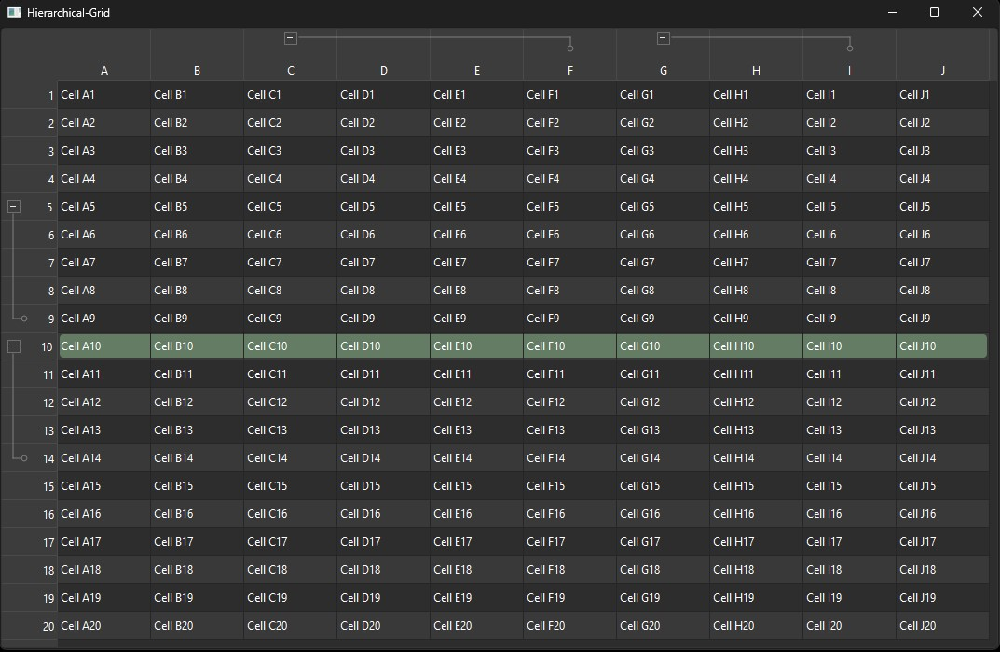

# Hierarchical Grid Widget for Qt6

igh-performance custom table view component built with **Modern C++ (C++20)** and **Qt6**. This project serves as a technical showcase demonstrating advanced software engineering patterns, custom UI/UX widget design, and modern C++ best practices.

It extends `QTableView` to support interactive, hierarchical row and column groupings with Excel-like collapse/expand aesthetics, automatic viewport sizing, and adaptive dark/light theme integration.

<p align="center">
  
</p>

---

## Technical Highlights & Showcased Skills

### 1. Modern C++ Design (C++17/C++20)
- **Strong Compile-Time Safety**: Leverages custom lightweight index wrappers (`RowIdx` and `ColIdx`) to prevent semantic errors (e.g., passing a column index into a row parameter).
- **Modern STL Idioms**: Utilizes `std::erase_if` for container cleanups, `std::as_const` for utility iteration, and `std::ranges` for modern element manipulation.
- **Const Correctness & Optimization**: Applies `[[nodiscard]]`, `constexpr`, and explicit conversions where appropriate to maximize compile-time safety and compiler optimization.

### 2. Advanced Qt6 Custom Widget Engineering
- **Subclassed View Components**: Integrates custom vertical and horizontal `QHeaderView` components (`GroupableHeaderView`) with a specialized `QTableView` (`GroupedTableView`).
- **Pixel-Perfect Rendering**: Bypasses basic font rendering for control elements. Group toggle buttons (`+`/`-`) are drawn dynamically using native line vectors. Antialiasing is carefully toggled off for layout borders to ensure crisp, razor-sharp 1px lines across high-DPI displays.
- **Dynamic Palette Adaptation**: Evaluates current system style palette settings to automatically adjust button fills, border shades, and symbol colors, providing out-of-the-box support for both light and dark modes.

### 3. Architecture & Separation of Concerns (SoC)
- **Isolated Logical Engine**: All grouping logic, boundary checking, and overlap validation are encapsulated inside a pure C++ class (`GroupModel`). It has zero dependencies on Qt or GUI libraries, making it fully testable in headless unit-testing environments.
- **Cohesive View Synchronization**: `GroupedTableView` coordinates user interaction from custom headers and updates row/column visibility states inside the Qt view pipeline.

### 4. Robust UX & Layout Sizing
- **Dynamic Viewport Fit**: Computes the exact geometry required to display all visible rows and columns (`sizeHint()`). 
- **Screen Bounds Detection**: Constrains the window's dimensions to 2/3 of the primary display's available screen bounds to guarantee a clean appearance on low-resolution monitors, and automatically centers the window.

---

## Repository Structure

```
├── assets/
│   └── Demo.jpg
├── CMakeLists.txt              # Modern CMake build system configuration (C++20, Qt6)
├── main.cpp                    # Application entry point
├── mainWindow.h / .cpp         # Main application window managing layout and setup
├── GroupModel.h / .cpp         # Pure C++20 logical model for group validation & states
├── GroupedTableView.h / .cpp   # Subclassed QTableView linking model & headers
└── GroupableHeaderView.h / .cpp# Custom QHeaderView for vector button drawing & bracket lines
```

---

## Getting Started

### Prerequisites
- **Compiler**: C++20 compliant compiler (MSVC 2022+, GCC 11+, or Clang 13+).
- **Build System**: CMake 3.16 or newer.
- **Framework**: Qt 6.x (Widgets module).

### Build & Run
1. Clone the repository:
   ```bash
   git clone https://github.com/yourusername/hierarchical-grid.git
   cd hierarchical-grid
   ```
2. Configure and build via CMake:
   ```bash
   mkdir build && cd build
   cmake ..
   cmake --build . --config Release
   ```
3. Run the executable:
   - **Windows**: `Release\Hierarchical-Grid.exe`
   - **Linux/macOS**: `./Hierarchical-Grid`

---

## API Usage Example

Creating a table, filling it with content, and configuring nested groupings is straightforward:

```cpp
#include "GroupedTableView.h"

// 1. Create and initialize the widget
auto *table = new GroupedTableView(parent);
table->init(20, 10); // 20 rows, 10 columns
table->fillTestData();

// 2. Establish row group (Button on Row 5 collapses Rows 6 to 9)
table->groupRow(4, 8); 

// 3. Establish column group (Button on Column C collapses Columns D to F)
table->groupColumn(2, 5); 
```

---

## License & Usage Restrictions

This repository is published for **viewing and evaluation purposes only** (e.g., as part of a personal portfolio). 

All rights are reserved. No part of this software, either in source or binary form, may be copied, modified, merged, published, distributed, sublicensed, or sold without explicit, prior written consent from the copyright holder. Refer to the [LICENSE](file:///c:/Users/roust/Documents/Projects/CPP/hierarchical-grid/LICENSE) file for complete details.

